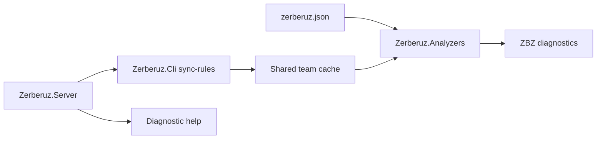

# Zerberuz v0.5 - End-to-End Flow Plan

## Big Picture

Zerberuz ya tiene las piezas base: reglas configurables, cache compartido por equipo, CLI, servidor MVP y analyzers Roslyn. El siguiente paso es probar el flujo completo como lo usaria un equipo real:

1. El servidor publica perfiles versionados de reglas y ayuda por diagnostico.
2. El CLI descarga el perfil compatible y lo escribe en el cache compartido del equipo.
3. El proyecto referencia `zerberuz.json` para resolver equipo, perfil, version y cache.
4. El analyzer carga las reglas desde el cache compartido y reporta diagnosticos.
5. La documentacion explica como repetir el flujo localmente sin conocimiento interno del codigo.

## Objetivo

Construir una ruta verificable de servidor a diagnostico:



## Alcance Tecnico

- Mantener pruebas deterministicas, sin depender de red externa.
- Usar el servidor real en pruebas mediante host de test.
- Permitir que el CLI use una fuente HTTP inyectable en pruebas sin cambiar su comportamiento normal.
- Agregar un sample intencionalmente violatorio para demostrar `ZBZ001` y `ZBZ100`.
- Evitar que el build normal falle si el cache aun no existe.
- Documentar el flujo local con comandos concretos.

## Commits Planeados

### 1. Documentar el plan E2E

Crear este documento en `agents` con big picture, alcance, diseno tecnico y criterios de aceptacion.

### 2. Preparar sample realista

- Agregar `samples/Zerberuz.Samples.Basic/zerberuz.json`.
- Incluir el archivo como `AdditionalFiles` en el sample.
- Cambiar el codigo sample para provocar reglas conocidas:
  - `ZBZ001`: interfaz sin prefijo `I`.
  - `ZBZ100`: clase `*Service` fuera de carpeta `Services`.
- Mantener el build estable cuando no exista cache compartido.

### 3. Probar servidor -> CLI -> cache compartido

- Configurar serializacion JSON del servidor para enums como strings.
- Permitir al CLI recibir una funcion de lectura de fuente para tests.
- Crear prueba de integracion que:
  - Levante el servidor en memoria.
  - Ejecute `sync-rules` contra el perfil `backend`.
  - Escriba reglas y ayuda en el cache compartido temporal.
  - Valide que el puntero `latest-compatible` queda correcto.

### 4. Probar sample -> analyzer -> diagnosticos

- Crear prueba que use el codigo real del sample.
- Crear cache compartido temporal con reglas reales.
- Inyectar `zerberuz.json` apuntando al cache temporal.
- Validar que el analyzer reporta `ZBZ001` y `ZBZ100`.

### 5. Documentar workflow local

- Actualizar README principal y README del sample.
- Incluir comandos para:
  - Levantar servidor local.
  - Sincronizar reglas.
  - Validar cache con `doctor`.
  - Compilar sample y observar diagnosticos.
  - Consultar ayuda detallada de un codigo.

## Decisiones de Diseno

### Cache compartido por equipo

El cache debe vivir en una ruta comun por equipo para evitar descargar las mismas reglas por proyecto. La resolucion queda asi:

```text
<cacheRoot>/teams/<team>/profiles/<profile>/versions/<rulesVersion>/rules.json
<cacheRoot>/teams/<team>/profiles/<profile>/versions/<rulesVersion>/help/<diagnosticId>.json
<cacheRoot>/teams/<team>/profiles/<profile>/latest-compatible.json
```

### Sample sin dependencia fragil del ambiente

El sample puede contener violaciones reales, pero no debe romper el build base si no hay reglas descargadas. Por eso el analyzer solo reporta cuando encuentra configuracion y cache valido.

### Tests sin red externa

Las pruebas deben usar host de test e inyeccion de lectura en el CLI. Esto mantiene el comportamiento de produccion intacto, pero permite validar el contrato servidor/CLI/cache sin abrir puertos ni depender de GitHub Actions o localhost.

### Ayuda por diagnostico

La ayuda por codigo (`ZBZ001`, `ZBZ100`, etc.) se sincroniza junto con las reglas. Eso permite que el CLI explique errores aun cuando el developer esta offline.

## Criterios de Aceptacion

- `dotnet build Zerberuz.sln -c Release` termina exitosamente.
- `dotnet test Zerberuz.sln -c Release --no-build` termina exitosamente.
- Existe un sample con `zerberuz.json` y codigo que demuestra diagnosticos reales.
- Existe una prueba de integracion del flujo servidor -> CLI -> cache.
- Existe una prueba del flujo cache -> analyzer -> diagnosticos.
- La documentacion explica el demo local completo.
