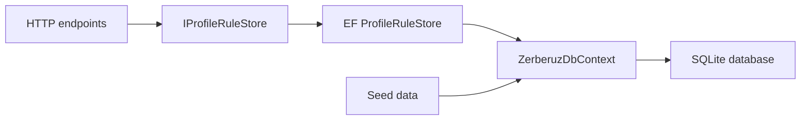

# Zerberuz v0.6 - EF Server Persistence Plan

## Big Picture

El servidor de Zerberuz necesita dejar de servir reglas desde memoria y empezar a persistir perfiles/versiones como datos gobernables. EF Core sera la capa de persistencia inicial para mantener el modelo portable y permitir migrar despues a SQLite, SQL Server, PostgreSQL u otro proveedor sin reescribir endpoints.

## Objetivo

Persistir perfiles de reglas versionados con EF Core sin cambiar el contrato HTTP existente:



## Alcance

- Agregar `ZerberuzDbContext`.
- Agregar entidad persistente para perfil/version de reglas.
- Guardar el `RuleSetDefinition` completo como JSON validado.
- Mantener `IProfileRuleStore` como frontera de lectura.
- Convertir lecturas del store a async para no bloquear threads del servidor.
- Configurar SQLite como proveedor local default.
- Agregar seed idempotente con el perfil `backend`.
- Mantener tests deterministicas.

## Modelo Inicial

### RuleProfileEntity

```text
Id
Profile
RulesVersion
SchemaVersion
MinimumEngineVersion
RuleSetJson
CreatedAtUtc
PublishedAtUtc
```

Indices:

```text
unique(Profile, RulesVersion)
index(Profile)
index(Profile, RulesVersion)
```

## Decisiones

### JSON primero

En esta etapa conviene persistir el `RuleSetDefinition` completo como JSON. Eso evita una explosion prematura de tablas para `rules`, `conditions`, `targets` y `help`. Cuando agreguemos busqueda avanzada, auditoria por regla o UI administrativa fina, podremos normalizar partes especificas.

### EF como frontera de persistencia

Los endpoints no deben conocer EF. Siguen hablando con `IProfileRuleStore`, y el store EF se encarga de materializar/deserializar reglas.

### SQLite default

SQLite es suficiente para desarrollo local y despliegues pequenos. La configuracion debe usar connection string para poder cambiar proveedor mas adelante.

### Seed idempotente

El servidor debe arrancar con el perfil `backend` disponible, pero sin duplicarlo si la base ya tiene esa version.

## Commits Planeados

### 1. Documentar plan EF

Crear este documento en `agents`.

### 2. Agregar capa de datos EF

- Agregar paquetes EF Core.
- Crear `ZerberuzDbContext`.
- Crear `RuleProfileEntity`.
- Crear serializer de rule sets.
- Crear `EfProfileRuleStore`.
- Crear seed data compartida.

### 3. Conectar server a EF

- Registrar DbContext con SQLite.
- Registrar `EfProfileRuleStore`.
- Inicializar base con `EnsureCreated`.
- Sembrar perfil `backend`.
- Actualizar endpoints a async.
- Actualizar pruebas del server.

## Criterios de Aceptacion

- Los endpoints existentes siguen devolviendo el mismo contrato.
- `sync-rules` puede seguir descargando desde server y escribiendo cache compartido.
- `dotnet build Zerberuz.slnx -c Release` termina exitosamente.
- `dotnet test Zerberuz.slnx -c Release --no-build` termina exitosamente.
