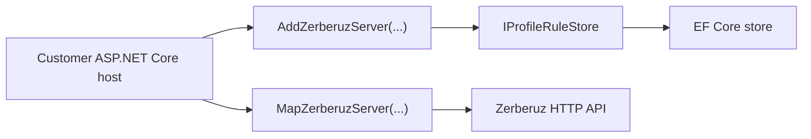

# Zerberuz v0.7 - Hostable Server NuGet Plan

## Big Picture

`Zerberuz.Server` debe poder instalarse como NuGet en cualquier host ASP.NET Core. El consumidor decide donde correrlo, como configurar autenticacion, que proveedor EF usar, que connection string aplicar, que rutas exponer y como integrarlo a su infraestructura.

El proyecto puede seguir teniendo un host local de demo, pero el valor principal del paquete debe vivir en extensiones reutilizables:



## Objetivo

Dejar `Zerberuz.Server` listo para empaquetarse como NuGet hosteable:

- Servicios registrables desde `IServiceCollection`.
- Endpoints registrables desde `IEndpointRouteBuilder`.
- EF configurable por el host.
- Inicializacion/seed opcional y explicita.
- Paquete NuGet con metadata basica.
- Documentacion de consumo.

## API Propuesta

```csharp
builder.Services.AddZerberuzServer(options =>
{
    options.UseSqlite("Data Source=zerberuz.db");
    options.SeedDefaultProfiles = true;
});

var app = builder.Build();
await app.Services.InitializeZerberuzServerAsync();
app.MapZerberuzServer();
```

## Decisiones

### El paquete no debe poseer el host

El paquete registra capacidades. El host decide puertos, auth, logging, health checks, rate limits, reverse proxy y deployment.

### EF configurable desde opciones

El default puede ser SQLite para onboarding, pero la configuracion debe aceptar un callback de `DbContextOptionsBuilder` para no amarrarnos a un solo proveedor.

### Seed explicito

El seed inicial es util para demo y smoke tests, pero debe poder apagarse en ambientes reales.

### Endpoints agrupables

`MapZerberuzServer()` debe mapear todos los endpoints actuales. Mas adelante puede aceptar prefix o versioning avanzado.

## Commits Planeados

### 1. Documentar plan hostable NuGet

Crear este documento en `agents`.

### 2. Extraer extensiones hosteables

- Crear `ZerberuzServerOptions`.
- Crear `ZerberuzServerServiceCollectionExtensions`.
- Crear `ZerberuzServerEndpointRouteBuilderExtensions`.
- Crear inicializador `InitializeZerberuzServerAsync`.
- Rehacer `Program.cs` para consumir esas extensiones.

### 3. Habilitar NuGet package

- Marcar `Zerberuz.Server` como packable.
- Agregar metadata de paquete.
- Generar package en build.
- Validar `dotnet pack`.

### 4. Documentar consumo del paquete

- README con ejemplo de host externo.
- Notas de SQLite default y configuracion EF custom.

## Criterios de Aceptacion

- `dotnet build Zerberuz.slnx -c Release` pasa.
- `dotnet test Zerberuz.slnx -c Release --no-build` pasa.
- `dotnet pack src/Zerberuz.Server/Zerberuz.Server.csproj -c Release --no-build` genera `.nupkg`.
- El host local sigue funcionando.
- Los tests E2E server -> CLI -> cache siguen verdes.
